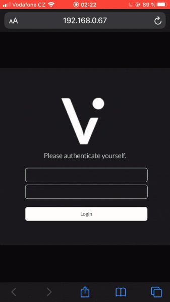

# Vistava

A media file server with a responsive web browser interface.

[Download Vistava 0.1 Installer](https://github.com/bauermaximilian/Vistava/releases/download/0.1/VistavaSetup_0.1.exe)

[Download Vistava 0.1 portable (as ZIP archive)](https://github.com/bauermaximilian/Vistava/releases/download/0.1/VistavaPortable_0.1.zip)

## About

There are many good reasons not to put all of your private pictures or videos into the cloud - be it privacy concerns or just economic reasons. However, missing out on the ability to easily access these media files from anywhere else but the computer they're stored on is a heavy price to pay. If only there was a solution to that problem...

## The solution to that problem

Vistava is a media file server, which can be executed on your PC and will create a share of a selected directory of media files, which can then be accessed on every other device in your network using a (modern) web browser.

## Features

- Support of common image and video formats (like JPG, PNG, GIF, MP4, WEBM)
- Easy setup of one or more accounts with different shared folders
- Fully responsive web interface 
- Supports Windows and Linux (using mono)

### Planned features

- The ability to switch to the next/previous media file directly in the file viewer
- A zoom function for images in the file viewer
- A command-line interface to run the server as service/daemon
- A more user-friendly setup and configuration
- An alternative, moodboard-like file view with thumbnails
- The ability to add tags to files and filter the displayed files using these tags
- MacOS support
- A ~~better~~ documentation

## Project state

This project is the second version of a private project I created many years ago but never released. Even though many errors and design flaws from the original version were fixed and this version, besides the .NET framework, doesn't have any dependencies (like additional external CSS or JavaScript libraries), it is possible that this application still contains bugs or security vulnerabilities - so it's not recommended to use this server outside your private network (e.g. as public web server).
