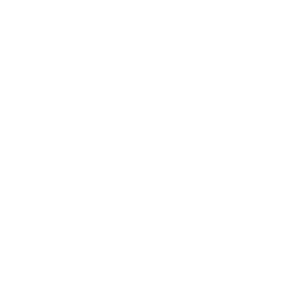
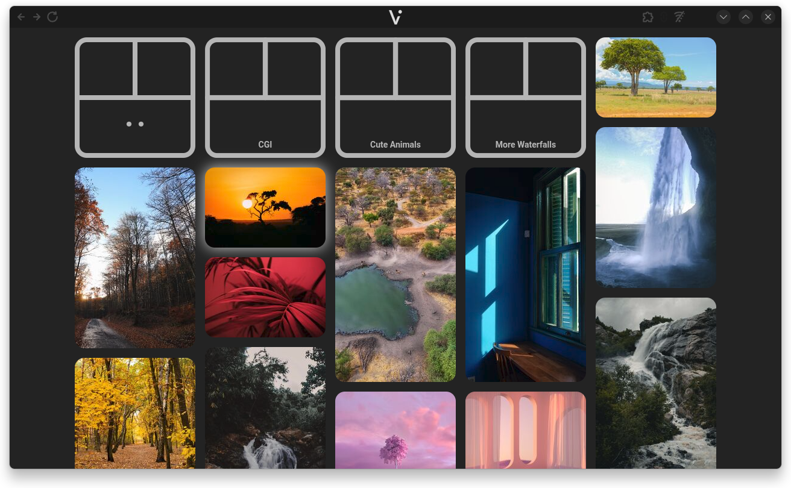

  

# Vistava

**Your media. No nonsense.**

A calm, minimalist viewer for images and videos. Vistava makes browsing your media
simple - on any device.

  

## What it does

- Browse your image and video library without distractions
- Use a mouse, keyboard, touch screen, or gamepad
- Share your library within your local home network
- Open the same interface on a TV, smartphone, tablet, or VR headset
- Extend the app with community-built integrations for third-party sources

## Local network sharing

Enable the optional sharing feature in the desktop app and Vistava generates a local
HTTP URL. Open it in a modern browser on another device in the same WiFi or LAN, or
scan the QR code shown in the app.

The second device gets the same UI and media library without copying files, using
cloud storage, or creating an account. Sharing is intended for private home networks;
do not enable it on public or insecure networks.

## Extensions

Community-maintained extensions can connect Vistava to third-party media sources like 
image boards or similar pages with HTTP APIs. Explore the available projects through the
[Vistava GitHub topic](https://github.com/topics/vistava).

## Downloads

Downloads are available on the [Releases page](https://github.com/bauermaximilian/Vistava/releases):

- **Windows:** installer (recommended) or portable ZIP
- **Linux:** Flatpak (recommended) or pacman package

## Project

Vistava began as a university project in 2020. I kept it as a personal side 
project after that and slowly developed it into a stable application that I 
wanted to share.

The desktop application is built with Electron. Its frontend uses HTML, CSS, and
modern JavaScript, while the backend is an ASP.NET 8 HTTP service which uses FFmpeg,
ImageMagick, and LiteDB for media processing and local thumbnail caching.

The app has no ads, analytics or user tracking, requires no subscriptions, 
does not depend on any cloud services and (excluding extensions) can be used 
without internet access.

## License

Copyright (C) 2026 Maximilian Bauer

This program is free software: you can redistribute it and/or modify
it under the terms of the GNU General Public License as published by
the Free Software Foundation, either version 3 of the License, or
(at your option) any later version.

This program is distributed in the hope that it will be useful,
but WITHOUT ANY WARRANTY; without even the implied warranty of
MERCHANTABILITY or FITNESS FOR A PARTICULAR PURPOSE.  See the
GNU General Public License for more details.

You should have received a copy of the GNU General Public License
along with this program.  If not, see <https://www.gnu.org/licenses/>.
